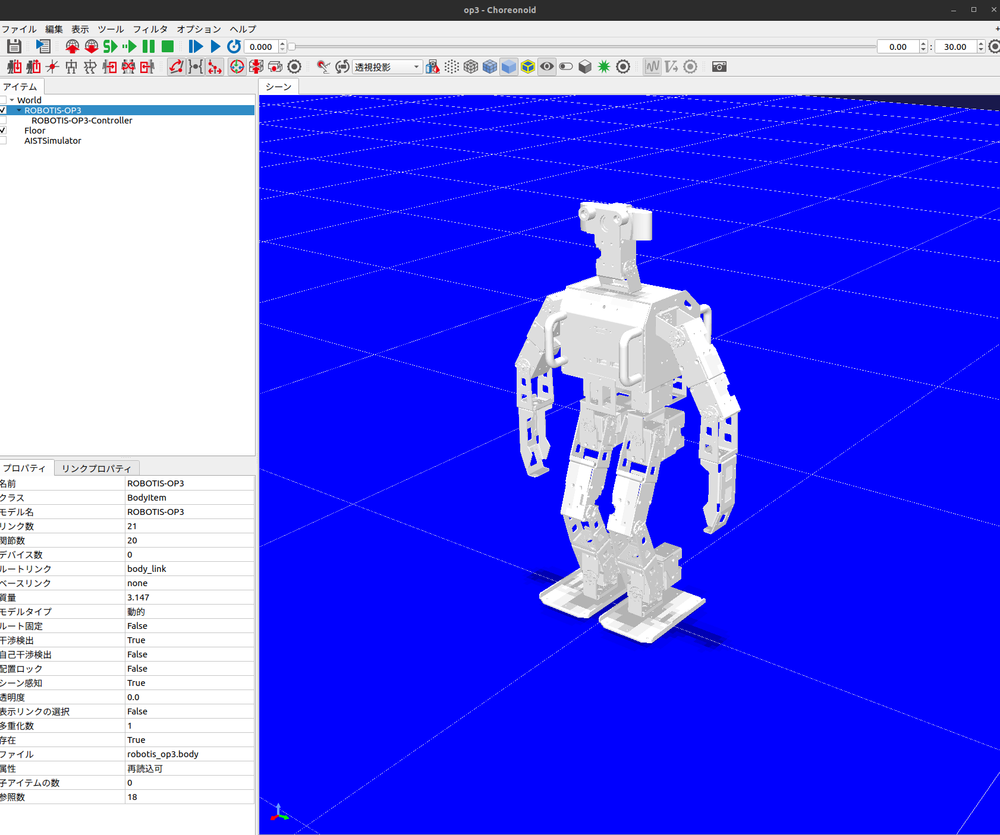

# ROBOTIS-OP3-Choreonoid

## How to use

### 1. Install Choreonoid
please see this repository.  
https://github.com/choreonoid/choreonoid

### 2. Build
```bash
mkdir workspace && cd workspace
git clone git@github.com:team-re-boot/ROBOTIS-OP3-Choreonoid.git
cd git@github.com:team-re-boot/ROBOTIS-OP3-Choreonoid.git
mkdir build && cd build
cmake ..
sudo make install
```
### 3. Run
```bash
cd workspace/ROBOTIS-OP3-Choreonoid
choreonoid project/op3.cnoid
```
<div align="center">

</div>